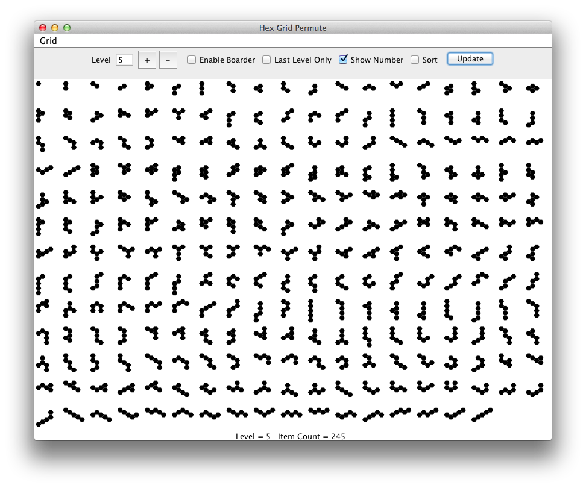
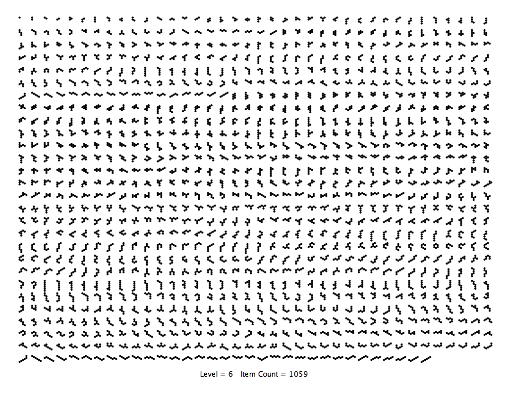

Hex-Grid-Permute
================

This a program finds all of the permutations of a fixed number of
connected hexagons. The program will also print the shapes to the
printer, rendering the shapes to maximize space used. The algorithm
starts with a single hexagon and tries to add neighbors to create a
unique hexagon pattern that has not been seen. The output from one
level feeds the next. If the output is unsorted you can see sibling
shapes from the same parent next to each other in the list.

Options:

* Enable Boarder - draws a box around each shape.

* Last Level Only - Only draws the last set of hexagon shapes with the largest number of hexagons.

* Show number - puts a label at the bottom of the screen showing level and number of shapes.

* Sort - sorts shapes first by number of hexagons and then by their average x/y ratio of each hexagon.

     

